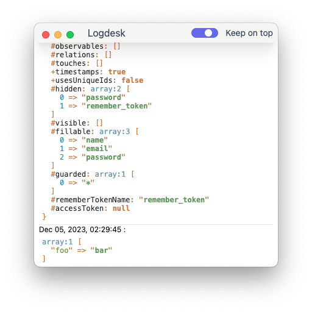

# Laravel Logdesk

insipired by [spatie ray](https://github.com/spatie/laravel-ray) create free version with minimum features.

## Installation

install this package

```bash
composer require jhonoryza/logdesk --dev
```

download desktop app here [https://github.com/jhonoryza/logdesk/releases/latest](https://github.com/jhonoryza/logdesk/releases/latest)



## Usage

```php
logdesk('ok'); // string
logdesk(new User()); // object
logdesk(['foo' => 'bar') // array
logdesk(true); // boolean
```

you can pass multiple value

```php
logdesk('ok', ['foo' => 'bar'], new User());
```

or you can have behaviour like `dd()` in laravel to die and dump

```php
logdeskDie('die');
```

### Security

If you've found a bug regarding security please mail [jardik.oryza@gmail.com](mailto:jardik.oryza@gmail.com) instead of using the issue tracker.

## License

The MIT License (MIT). Please see [License File](LICENSE.md) for more information.
